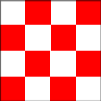
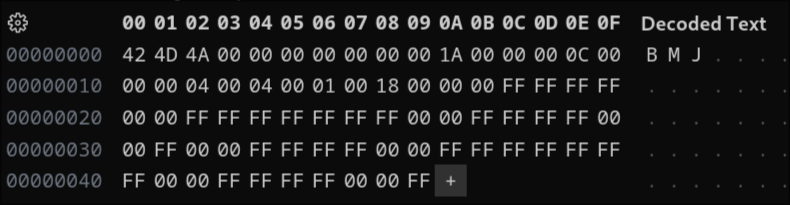

<h3> A.0 </h3>

L'erreure afficher par display est que la longeur et la taille de l'image ne convienne pas.
la raison est que le premier octet était a 99 au lieux que 9A, mais pour que display affiche correctement l'image il faut que que le première quarter soient initialiser à 0 donc il faut mettre 9A. 

<h3> A.1 </h3>

 voici le resultat : 

mais bon ce résultat ne prouve rien. Pour pouvoir arriver à cela il à fallu modifier le fichier bmp en héxadécimal    Les premier octets répresente "BM" la signature de bmp, ensuite la taille de l'image ici 4A pour 74 octets ensuite les coordonée de la ou les pixels commence, ici les pixels commence à l'adresse 1A, après 0C réprente la taille de la seconde partie, le 04 04 représente la hauteur et la largeure ici c'est du 4x4, pour le 18 c'est la valeur héxadécimal de 24, car sur pour réprésenter les couleurs RVB chacune des couleurs sont codée sur 1 octet, donc 3, sachant qu'un octet c'est 8 bit il faut faire 3*8 donc 24 donc 18 en héxa   Ensuite le reste c'est les pixels qui sont mit en fonction de leurs couleur, puisqu'on on est en little endian on fait bleu vert rouge.

<h3>A.2</h3>

 
 
 
